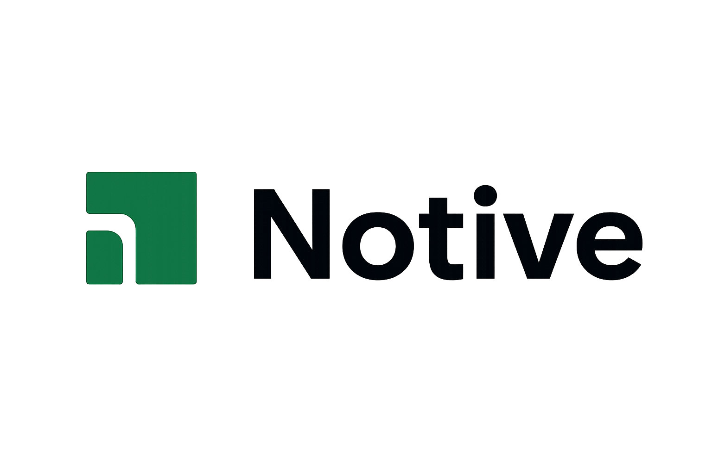
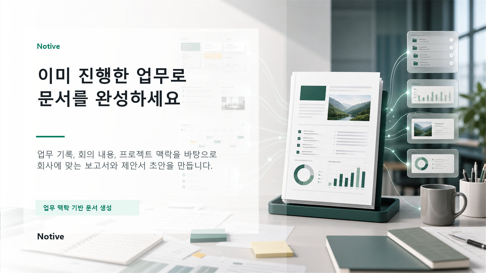
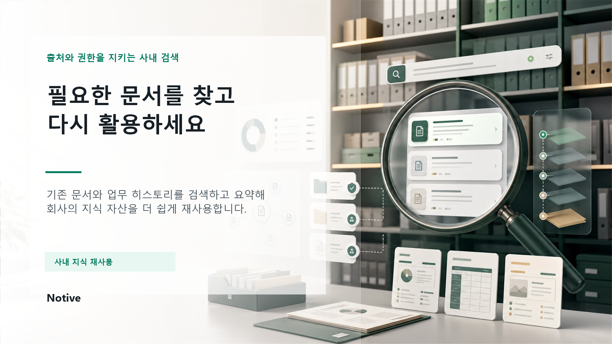
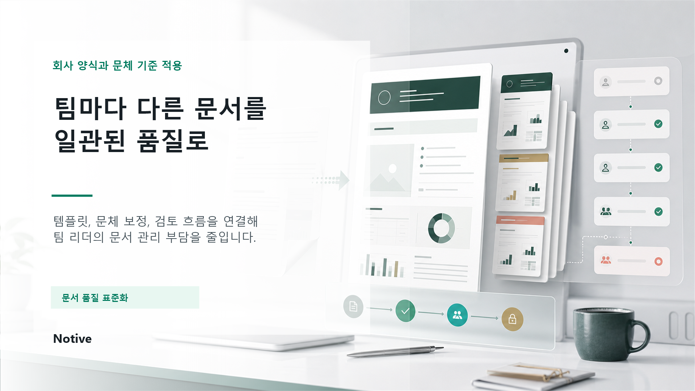

# Notive

<p align="center">
  
</p>

<p align="center">
  <strong>회사의 업무 흐름을 이해하고, 흩어진 기록을 문서와 지식 자산으로 바꾸는 AI 업무 운영 플랫폼</strong>
</p>

<p align="center">
  <a href="docs/prd/notive-prd-v1.0.md">PRD</a>
  ·
  <a href="docs/implementation/notive-implementation-plan-v1.0.md">Implementation Plan</a>
  ·
  <a href="docs/architecture/notive-technical-architecture-v1.0.md">Architecture</a>
  ·
  <a href="docs/README.md">Docs</a>
</p>

---

<p align="center">
  
</p>

## What Is Notive?

Notive는 기업 내부의 문서, 업무 기록, 회의 내용, 일정, To-do, 프로젝트 맥락을 연결해 실제 업무에 맞는 문서 초안을 만들고 관리하는 AI 기반 사내 문서 및 업무 운영 플랫폼입니다.

단순히 프롬프트를 입력해 문서를 생성하는 도구가 아니라, 회사 안에 이미 흩어져 있는 업무 맥락을 바탕으로 보고서, 회의록, 제안서, 정책 문서, SOP 같은 업무 문서를 더 빠르고 일관되게 완성하는 것을 목표로 합니다.

> 문서를 새로 쓰는 시간이 아니라, 이미 진행한 업무를 정리하는 시간을 줄입니다.

---

## Core Value

| Value | Description |
| --- | --- |
| 업무 맥락 기반 생성 | 업무 기록, 회의 메모, 프로젝트 상태, To-do를 바탕으로 문서 초안을 생성합니다. |
| 문서 품질 표준화 | 회사 템플릿과 문체 기준을 적용해 팀마다 다른 문서 품질 편차를 줄입니다. |
| 사내 지식 재사용 | 기존 문서와 업무 히스토리를 검색하고 요약해 다시 활용합니다. |
| 권한 기반 보안 | 문서, 검색 결과, AI 참고 자료 모두 사용자 권한 범위 안에서만 처리합니다. |
| 운영 가능한 SaaS 구조 | SMB 대상 Web SaaS로 시작해 향후 엔터프라이즈 환경까지 확장합니다. |

---

## Product Pillars

### Work Context Hub


Notive는 문서, 일정, To-do, 회의 메모, 프로젝트 상태를 하나의 업무 맥락으로 연결합니다.

반복 정리보다 실제 업무 완성에 집중할 수 있도록, 사용자가 이미 남긴 기록을 문서 생성의 기반으로 사용합니다.

### Context-Aware Document Generation

업무 기록과 기존 문서를 바탕으로 보고서, 회의록, 제안서, 기획서, SOP, 이메일 초안 등을 생성합니다.

AI 결과는 항상 초안으로 제공되며, 사용자가 검토하고 수정한 뒤 문서로 저장합니다.

### Knowledge Reuse



사내 문서를 자연어로 검색하고, 출처가 있는 요약을 제공합니다.

권한 없는 문서는 검색 결과와 AI 요약 근거에 포함되지 않으며, 사용자는 원문 출처를 확인한 뒤 필요한 문서를 재사용할 수 있습니다.

### Template Quality



회사 또는 팀별 문서 템플릿, 문체 기준, 검토 흐름을 연결해 문서 품질을 표준화합니다.

팀마다 다른 형식으로 작성되던 문서를 일관된 품질로 관리하는 것이 목표입니다.

---

## MVP Scope

Notive MVP는 “업무 맥락을 반영한 AI 문서 생성이 실제 업무 문서 작성 시간을 줄일 수 있는가”를 검증하는 데 집중합니다.

### Included

* 사용자 인증과 조직 관리
* 역할 기반 권한 관리
* 문서 작성, 저장, 수정, 공유
* 문서 버전 관리
* AI 문서 생성
* 템플릿 기반 문서 생성
* 업무 다이어리
* 기본 To-do
* 사내 문서 검색
* AI 요약 검색
* 관리자 기능
* 활동 로그와 기본 사용 현황

### Not In MVP

* 모바일 앱
* Desktop App
* On-Premise/VPC
* 실시간 음성 회의록
* 외부 서비스 연동
* AI Agent 자동 실행
* 결제/플랜 관리

---

## Architecture Direction

Notive는 초기에는 Web SaaS 중심으로 단순하게 시작합니다.

```text
User Browser
  -> Web App / API
    -> Auth & Permission
    -> Document Module
    -> AI Generation Module
    -> Work Context Module
    -> Search Module
    -> Admin Module
  -> PostgreSQL
  -> Object Storage
  -> AI Provider
  -> Search Index
  -> Logging / Monitoring
```

초기에는 빠른 검증을 우선하되, AI 처리와 검색 인덱싱은 향후 별도 워커 또는 서비스로 분리할 수 있는 구조를 지향합니다.

---

## Repository Structure

```text
.
├─ docs/
│  ├─ ai/
│  ├─ api/
│  ├─ architecture/
│  ├─ assets/
│  ├─ database/
│  ├─ implementation/
│  ├─ operations/
│  ├─ prd/
│  ├─ qa/
│  ├─ security/
│  └─ ux/
├─ CLAUDE.md
├─ CODEX.md
└─ README.md
```

문서 전체 인덱스와 읽는 순서는 [docs/README.md](docs/README.md)를 기준으로 합니다.

---

## Branch Strategy

기본 개발 통합 브랜치는 `develop`입니다.

**배포 전까지 `main`은 건드리지 않습니다. 모든 개발 머지와 푸시는 `develop` 기준으로만 진행합니다.**

| Branch | Purpose |
| --- | --- |
| `main` | 배포 직전 또는 릴리즈 시점에만 갱신하는 안정 브랜치 |
| `develop` | 개발 통합 브랜치 |
| `feature/*` | 개별 기능 개발 |
| `fix/*` | 버그 수정 |
| `docs/*` | 문서 수정 |

개별 기능은 반드시 `develop`에서 브랜치를 만들어 작업하고, 완료 후 검증을 거쳐 `develop`에 머지한 뒤 `develop`만 푸시합니다.

작업 원칙:

* `main`에 직접 커밋하지 않습니다.
* `main`에 직접 푸시하지 않습니다.
* 기능 구현은 `feature/*` 브랜치에서만 진행합니다.
* 버그 수정은 `fix/*` 브랜치에서 진행합니다.
* 문서 수정은 `docs/*` 브랜치 또는 단순 변경 시 `develop`에서 진행할 수 있습니다.
* 작업 완료 후 `develop`에 머지하고 `origin/develop`에 푸시합니다.
* `main` 반영은 명시적인 배포 지시가 있을 때만 진행합니다.

---

## Collaboration Model

이 프로젝트는 다음 협업 기준을 사용합니다.

* Codex: 설계, 작업 지시, 코드 리뷰, 검증, 품질 판단
* Claude: 실제 개발 구현, 테스트 작성, 수정 작업

상세 기준은 [CODEX.md](CODEX.md), [CLAUDE.md](CLAUDE.md)를 따릅니다.

---

## Asset Policy

`download/` 폴더는 작업용 원본 자산 보관 위치입니다.

* `download/` 내부 파일은 Git 업로드 대상에서 제외합니다.
* 코드와 문서에서 `download/` 경로를 직접 참조하지 않습니다.
* 필요한 로고, 파비콘, 포스터, 샘플 이미지는 프로젝트 내부 적절한 위치로 복사한 뒤 사용합니다.

현재 README 이미지는 `download/`에서 직접 참조하지 않고 `docs/assets/brand/`로 복사한 파일을 사용합니다.

---

## Documentation

| Area | Document |
| --- | --- |
| Product | [PRD](docs/prd/notive-prd-v1.0.md) |
| Implementation | [Overall Plan](docs/implementation/notive-implementation-plan-v1.0.md) |
| Architecture | [Technical Architecture](docs/architecture/notive-technical-architecture-v1.0.md) |
| Database | [DB Design](docs/database/notive-database-design-v1.0.md) |
| API | [API Spec](docs/api/notive-api-spec-v1.0.md) |
| UX | [Screen/UX Design](docs/ux/notive-screen-ux-design-v1.0.md) |
| Security | [Permission Policy](docs/security/notive-permission-policy-v1.0.md) |
| AI | [AI Generation Policy](docs/ai/notive-ai-generation-policy-v1.0.md) |
| QA | [Test Plan](docs/qa/notive-test-plan-v1.0.md) |
| Operations | [Deployment & Operations Guide](docs/operations/notive-deployment-operations-guide-v1.0.md) |

---

